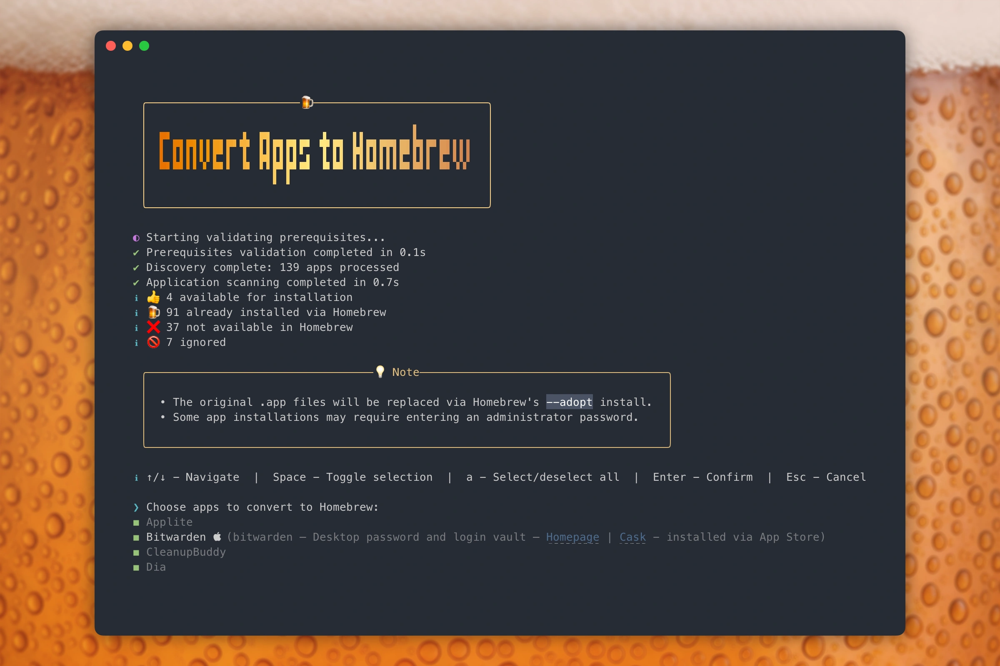
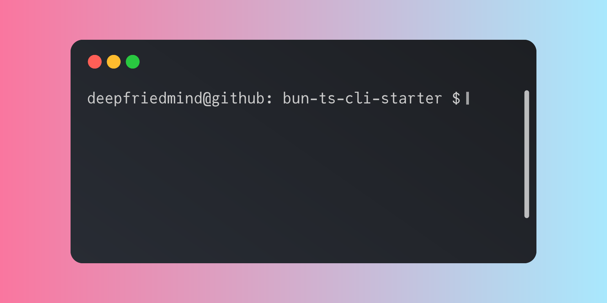

# convert-apps-to-homebrew


[](https://biomejs.dev)

A CLI tool for macOS that automatically discovers apps in your `/Applications` directory and converts them to Homebrew-managed installations, i.e. convert apps to brew.



## Features

- **Automatic Discovery**: Scans `/Applications` directory and identifies available Homebrew packages
- **Interactive Selection**: Checkbox interface for selecting apps to install
- **Dry-Run Mode**: Preview changes without executing them
- **Flexible Filtering**: Pre-ignore specific applications and/or App Store apps

## Quick Start

### Installation

```bash
# Run directly with npx (recommended)
npx convert-apps-to-homebrew@latest

# Or install globally
npm install -g convert-apps-to-homebrew
convert-apps-to-homebrew
```

## Requirements

- **macOS**: This tool is designed specifically for macOS
- **Node.js 16+**: Required for running the application (bun required for development)
- **Homebrew**: Must be installed and accessible in PATH
- **[mas-cli](https://github.com/mas-cli/mas)** (optional): For Mac App Store integration - install with `brew install mas`
  - Required for detecting if apps are installed via Mac App Store.

## Command-line options

| Option                      | Description                                                                            | Example                                                     |
| --------------------------- | -------------------------------------------------------------------------------------- | ----------------------------------------------------------- |
| `--ignore <apps...>`        | Ignore specific applications                                                           | `--ignore "Adobe Photoshop" "Microsoft Word" google-chrome` |
| `--ignore-app-store`        | Ignore apps installed via App Store (requires [`mas`](https://github.com/mas-cli/mas)) |                                                             |
| `--dry-run`                 | Preview changes without executing                                                      |                                                             |
| `--verbose`                 | Enable detailed logging                                                                |                                                             |
| `--applications-dir <path>` | Custom applications directory                                                          | `--applications-dir /Applications`                          |
| `--help`                    | Show help information                                                                  |                                                             |
| `--version`                 | Show version number                                                                    |                                                             |

## Development

This project was based on my [Bun TS CLI Starter](https://github.com/deepfriedmind/bun-ts-cli-starter).

[](https://github.com/deepfriedmind/bun-ts-cli-starter)

### Building from source

```bash
# Clone the repository
git clone https://github.com/deepfriedmind/convert-apps-to-homebrew.git
cd convert-apps-to-homebrew

# Install dependencies
bun install

# Run the project
bun start

# Build the project
bun run build

# Run tests
bun test

# Run tests with coverage
bun test --coverage

# Run all checks
bun run check
```

## Contributing

Contributions are welcome! Please feel free to submit a Pull Request. For major changes, please open an issue first to discuss what you would like to change.

### Development guidelines

1. **TypeScript**: All code must be written in TypeScript
2. **Testing**: New features must include comprehensive tests
3. **Documentation**: Update README.md for new features
4. **Code Style**: Follow the existing code style and linting rules

## License

This project is licensed under the MIT License - see the [LICENSE](LICENSE) file for details.

## Acknowledgments

- [Homebrew](https://brew.sh/) - The missing package manager for macOS
- [Commander.js](https://github.com/tj/commander.js) - Command-line interface framework
- [Consola](https://github.com/unjs/consola) - Elegant Console Logger for Node.js and Browser

## Troubleshooting

### Common Issues

#### "Homebrew is not installed"

Install [Homebrew](https://brew.sh/):

```bash
/bin/bash -c "$(curl -fsSL https://raw.githubusercontent.com/Homebrew/install/HEAD/install.sh)"
```

#### "Node.js version `<installed version>` is not supported. Please use Node.js `<required version>` or later."

Install latest Node.js:

```bash
brew install node
```

#### "Permission denied"

- Ensure you have read access to `/Applications`
- Homebrew's `--adopt` flag is used to manage existing applications

#### "No applications found"

- Check that applications exist in `/Applications`
- Try using `--applications-dir` to specify a different path

For more help, run with `--verbose` flag for detailed error information.

---
